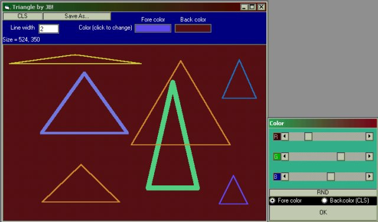



## Make triangles in VB\!

### Description

Draw triangles on a picture box!
 
### More Info
 

             |
---                |---
**Submitted On**   |2000-04-15 21:53:18
**By**             |[Johannes B](https://github.com/Planet-Source-Code/PSCIndex/blob/master/ByAuthor/johannes-b.md)
**Level**          |Beginner
**User Rating**    |5.0 (10 globes from 2 users)
**Compatibility**  |VB 4\.0 \(32\-bit\), VB 5\.0, VB 6\.0
**Category**       |[Complete Applications](https://github.com/Planet-Source-Code/PSCIndex/blob/master/ByCategory/complete-applications__1-27.md)
**World**          |[Visual Basic](https://github.com/Planet-Source-Code/PSCIndex/blob/master/ByWorld/visual-basic.md)
**Archive File**   |[CODE\_UPLOAD48294152000\.zip](https://github.com/Planet-Source-Code/johannes-b-make-triangles-in-vb__1-7299/archive/master.zip)

